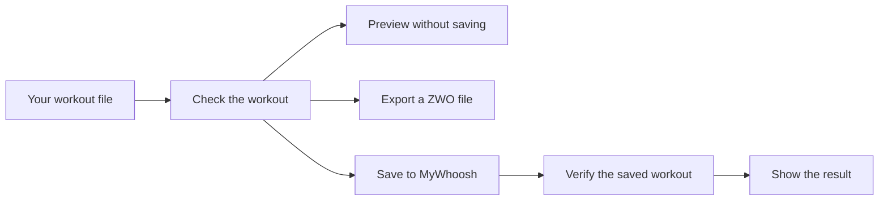
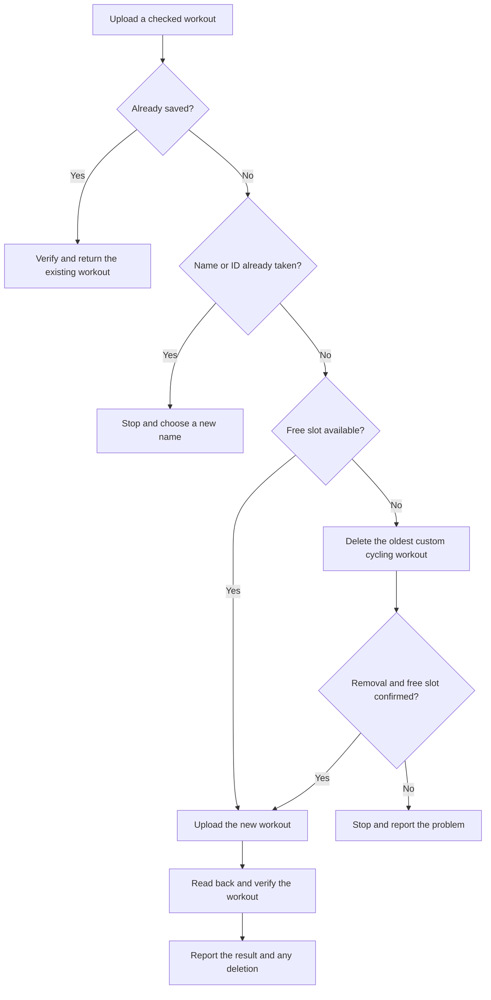

# MyWhoosh Workout Uploader

An unofficial workout uploader for MyWhoosh, not affiliated with MyWhoosh. Repository and npm package name: `whoosh-uploader`. The terminal command is `whoosh-uploader`.

Create cycling workouts from a JSON file, upload them to MyWhoosh, or export them as ZWO files. The CLI checks your workout before uploading and reads it back afterward to verify that it was saved correctly.

**When your workout slots are full, uploading automatically deletes your oldest custom cycling workout without asking for confirmation.** This includes workouts created outside this tool. It removes at most one workout per run and continues only after confirming that a slot is available.

## How it works



Sign in once to save a session. After that, uploads run from the terminal without opening a browser. If your session expires, sign in again.

## Quick start

You need Node.js 22 or newer and a MyWhoosh account for uploads. Validation, previews, and file exports work offline.

```sh
npm ci
node bin/whoosh.js validate examples/tempo-steps.json
node bin/whoosh.js upload examples/tempo-steps.json --dry-run
node bin/whoosh.js auth login
node bin/whoosh.js upload examples/tempo-steps.json
```

Before uploading an example, set its `ftp_watts` to the FTP you use in MyWhoosh and adjust the workout to suit your session. Examples demonstrate the file format; they are not personalized training recommendations.

Login uses Microsoft Edge by default on Windows. For Chrome, run `node bin/whoosh.js auth login --channel chrome`. For bundled Chromium, run `npx playwright install chromium` first. See the [setup reference](REFERENCE.md#setup) for Linux browser requirements and other authentication options.

On Windows, use `npm.cmd` or `npx.cmd` if PowerShell blocks the corresponding wrapper. All commands can run directly through `node`; a global installation is optional.

## What happens during upload



"Oldest" means the earliest creation date. Repeating an unchanged workout returns the existing copy without deleting anything. A preview with `--dry-run` never changes your account.

If MyWhoosh blocks deletion because a workout is used in a training plan, or no slot is returned, the CLI stops. It does not keep deleting workouts. Deletion cannot be undone by a failed upload, and each new run can select another oldest workout, so inspect an error before retrying.

## Common commands

Run these from the repository folder, replacing `workout.json` with your input file.

```sh
node bin/whoosh.js validate workout.json
node bin/whoosh.js build workout.json --out dist/workout.zwo
node bin/whoosh.js upload workout.json
node bin/whoosh.js list
node bin/whoosh.js delete <workout-id>
node bin/whoosh.js --help
node bin/whoosh.js upload --help
node bin/whoosh.js help auth login
```

The explicit `delete` command also runs without confirmation. Successful commands print JSON, including the upload result and any workout removed to make room. Errors include a code and message.

Use `<command> --help` or `help <command>` for options, examples, and results. Help works offline without a token or input file. Upload help includes a minimal workout and the supported step formats, so you can use the installed CLI without this repository.

### Preview before uploading

`--dry-run` validates the input and prints a summary plus the native upload payload. It does not sign in, contact MyWhoosh, check credits or remote duplicates, upload, or delete anything. It reports `dry_run`, which does not prove that the server will accept an upload.

## Limits and compatibility

- Supports time-based cycling workouts, including steady efforts, ramps, repeats, cadence, captions, and free ride. Maximum 30 steps after expanding repeats.
- Power targets scale with your MyWhoosh FTP. This tool does not change your profile FTP.
- Uses the website's undocumented API, which may change. It is an independent tool, not an official MyWhoosh integration.
- Uploads have been verified on Windows and native Linux under WSL. In-game playback and trainer behavior have not been verified.
- Windows protects saved sessions with DPAPI. Linux stores them in an owner-only plaintext file.

## Development

```sh
npm ci
npm test
npm run check
```

Tests use synthetic credentials and mocked API responses. They do not upload or delete real workouts. GitHub Actions runs the same checks on Windows and Linux with Node.js 22 and 24.

The command interface is in `bin/`, application code in `src/`, and automated checks in `test/`. The [reference](REFERENCE.md#code-layout) describes the individual modules.

## Documentation

- [Reference](REFERENCE.md): setup, workout format, commands, API behavior, and troubleshooting.
- [Workout schema](workout.schema.json) and [examples](examples/): supported input files.
