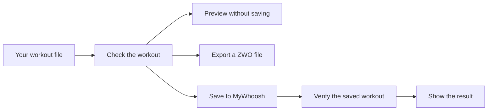
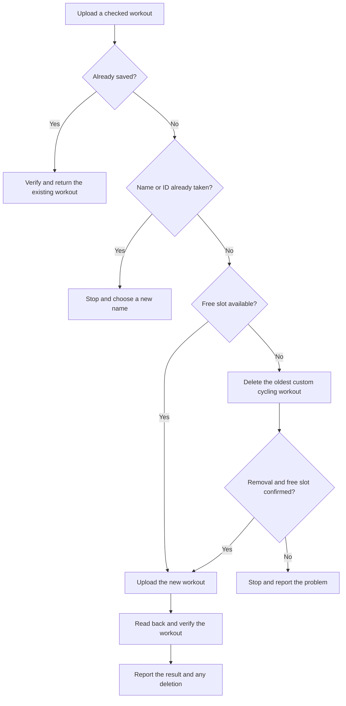

# MyWhoosh Workout Uploader

Unofficial CLI tool for creating, uploading, and managing MyWhoosh cycling workouts from JSON. Also exports ZWO files. Package and command: `whoosh-uploader`.

**When slots are full, uploading deletes your oldest custom cycling workout without confirmation, including workouts created outside this tool.** At most one is deleted per run, selected by creation date.

## How it works



## Quick start

Requires Node.js 22+ and a MyWhoosh account for uploads. From a checkout:

```sh
npm ci
node bin/whoosh.js upload examples/tempo-steps.json --dry-run
node bin/whoosh.js auth login
node bin/whoosh.js upload examples/tempo-steps.json
```

Before uploading, set `ftp_watts` to your current MyWhoosh FTP and adjust the example to your training needs. Examples demonstrate the format, not personalized training advice.

Sign in once; the session is cached until it expires. Login defaults to Edge on Windows and Chromium on Linux. Use `--channel chrome` for Chrome; install bundled Chromium with `npx playwright install chromium`. See [setup](REFERENCE.md#setup) for Linux requirements and session storage.

Optionally run `npm link` to use `whoosh-uploader` instead of `node bin/whoosh.js`. On Windows, use the `.cmd` wrappers if PowerShell blocks scripts.

## What happens during upload



Unchanged uploads return the verified existing copy without deletion. Name or ID conflicts stop before slot recovery. Blocked deletion or a missing slot refund also stops the upload.

A failed upload cannot undo a deletion. Writes are never automatically retried; inspect errors before rerunning, since another run could delete another workout. Run uploads serially per account.

## Common commands

```sh
node bin/whoosh.js validate workout.json
node bin/whoosh.js build workout.json --out dist/workout.zwo
node bin/whoosh.js upload workout.json
node bin/whoosh.js upload workout.json --dry-run
node bin/whoosh.js list
node bin/whoosh.js delete <workout-id>
node bin/whoosh.js --help
node bin/whoosh.js upload --help
```

- `--dry-run` validates and prints the upload payload offline. It never uploads or deletes, and does not check authentication, credits, duplicates, or server acceptance. Validation and exports also work offline.
- `delete` removes the specified workout without confirmation.
- Results are JSON on stdout; errors are JSON on stderr. Successful uploads return `uploaded` or `already_exists` with `verified: true`; any removal is reported as `deleted_workout`.
- `<command> --help` or `help <command>` works offline and includes options, examples, and workout input formats.

## Limits and compatibility

- Time-based cycling workouts: steady efforts, ramps, repeats, cadence, captions, and free ride. Maximum 30 expanded steps.
- Power scales with your MyWhoosh FTP; the tool does not change your profile FTP.
- Uses an undocumented API that may change. Uploads are verified on Windows and Linux under WSL, but not in-game playback or trainer behavior.
- Sessions use DPAPI on Windows and owner-only plaintext files on Linux.

## Development

```sh
npm test
npm run check
```

Tests use synthetic credentials and mocked HTTP, never your live account. CI runs on Windows and Linux with Node.js 22 and 24.

## Documentation

- [Reference](REFERENCE.md): setup, workout format, commands, API behavior, and troubleshooting.
- [Workout schema](workout.schema.json) and [examples](examples/): supported input files.
